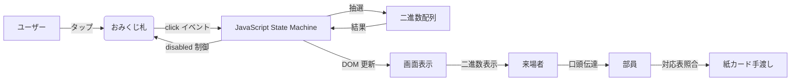

# 二進数おみくじ 技術解説

本ドキュメントは、「二進数おみくじ」の設計思想、実装詳細、パフォーマンス考察を記した技術者向け資料です。  
一般向けの遊び方や開発ストーリーは note記事 をご参照ください。

## 1. システムアーキテクチャ

本プロダクトは **純粋な静的サイト** として構築されており、GitHub Pages 上でホストされています。サーバーサイド処理を一切持たず、以下のクライアントサイド技術のみで完結します。

| レイヤー | 使用技術 | 役割 |
| :--- | :--- | :--- |
| 構造 | HTML5 | セマンティックなマークアップ、data-*属性によるメタデータ管理 |
| 表現 | CSS3 | Flexboxによる流動的レイアウト、writing-modeを用いた縦書き実装 |
| ロジック | JavaScript (ES6) | イベント駆動型の状態遷移、setTimeoutによる非同期演出制御 |

### 1.1 データフロー



## 2. 状態遷移設計

抽選処理はシンプルな3状態で管理しています。isDrawing フラグと CSS クラス .disabled の二重ロックにより、連打や誤操作を防止します。

```mermaid
stateDiagram-v2
    [*] --> IDLE
    IDLE --> DRAWING : 札クリック
    DRAWING --> RESULT : setTimeout(2.5s)
    RESULT --> IDLE : 自動復帰

    note right of IDLE : 全札クリック可能\nbinaryNumber: "----"
    note right of DRAWING : 全札に .disabled 付与\npointer-events: none\nwaitingMsg: "抽選中・・・"
    note right of RESULT : 二進数表示\nbinarySuffix: "(2)"\n.disabled 解除
```

## 3. UI 実装の詳細

### 3.1 縦書き札の実現

```css
.omikuji-card {
    writing-mode: vertical-rl;
    text-orientation: upright;
}
```

- writing-mode: vertical-rl : 文字を右から左へ縦書きに設定。
- text-orientation: upright : 英数字も縦向きに正立表示（おみくじ が縦一列になる）。

### 3.2 ホバーエフェクト（パフォーマンス最適化）

```css
.omikuji-card {
    transition: transform 0.2s ease, box-shadow 0.2s ease;
}
.omikuji-card:hover {
    transform: translateY(-6px);
    box-shadow: ...;
}
```

- transform と box-shadow のみを遷移対象とし、Composite Layer でのレンダリングを促進。
- will-change プロパティは過剰指定を避け、必要なタイミングのみブラウザに最適化を委ねた。

### 3.3 連打防止（UI ロック）

```javascript
function startDrawing() {
    isDrawing = true;
    const allCards = document.querySelectorAll('.omikuji-card');
    allCards.forEach(card => card.classList.add('disabled'));
    // ...
}
```

```css
.omikuji-card.disabled {
    pointer-events: none;
    opacity: 0.6;
}
```

- JavaScript フラグ isDrawing によるイベントハンドラ内ガードと、CSS によるポインターイベント遮断の 二重防御。
- 待機中に札がクリックされる可能性を完全に排除。

### 3.4 二進数サフィックス表示

```html
<div id="binary-display">
    <span id="binary-number">----</span>
    <span id="binary-suffix"></span>
</div>
```

- 二進数本体と (2) を別要素で管理し、JavaScript で個別に textContent を更新。
- CSS Flexbox でベースラインを揃え、視覚的な一体感を確保。

## 4. 抽選ロジック

```javascript
const BINARY_LIST = [
    "0000", "0001", "0010", "0011",
    "0100", "0101", "0110", "0111",
    "1000", "1001", "1010", "1011",
    "1100", "1101", "1110", "1111"
];

const randomIndex = Math.floor(Math.random() * BINARY_LIST.length);
```

- 乱数生成には Math.random() を使用。エンターテインメント用途のため、疑似乱数で十分と判断。
- 16 種類の二進数は 等確率。重み付けは行わず、公平な抽選を実現。

## 5. パフォーマンス設計

- **外部依存の最小化**: Google Fonts（`display=swap` 適用）のみ。広告・トラッキングスクリプトは一切排除。
- **レンダリング最適化**: `transform` と `box-shadow` のみを遷移対象とし、Composite Layer での描画を促進。
- **静的ホスティング**: GitHub Pages による CDN 配信で、初回ロードを高速化。

## 6. アクセシビリティ対応

- タップ領域: おみくじ札のサイズを 90x140px（スマホでも 70x110px）に設定し、WCAG 推奨の 44x44px を大きく上回る。
- コントラスト比: 朱色背景 (#c84b3f) と金色文字 (#f9e076) の組み合わせは、コントラスト比約 4.2:1（WCAG AA 級相当）。
- フォントサイズ: 二進数表示は 90px（モバイル 60px）とし、視認性を確保。

## 7. 今後の拡張余地

| 機能 | 実装方針 |
| :--- | :--- |
| オフライン対応 | Service Worker によるキャッシュ戦略（PWA 化） |
| 結果画像保存 | html2canvas を用いたスクリーンショット生成 |
| 効果音再生 | Web Audio API による鈴の音（ユーザーインタラクション必須） |
| 結果統計表示 | Google Apps Script を介した簡易集計（プライバシー配慮） |

## 8. 開発環境とライセンス

- 開発スタイル: AI 支援開発（AI-assisted development）を採用。Cursor / VS Code 上で対話的にコード生成。
- ライセンス: MIT License
- リポジトリ: https://github.com/shimataiyaki/binary-omikuji

© 2026 Shimataiyaki
